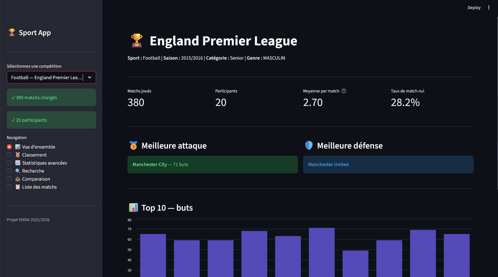
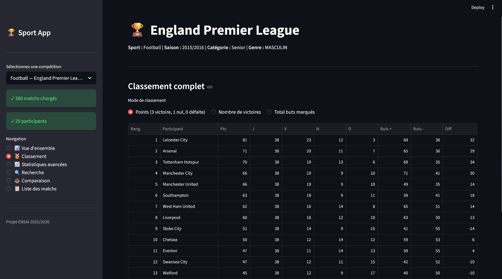
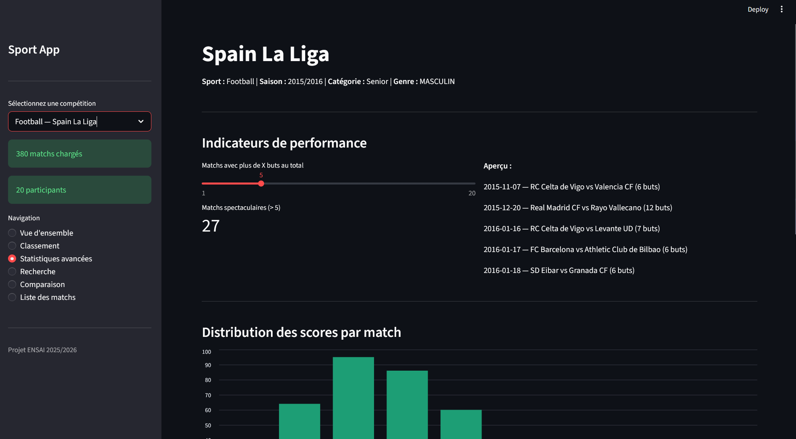

# Sport App - Gestion et analyse de résultats sportifs

Projet de traitement de données - ENSAI 2025/2026  
Projet réalisé en **groupe** dans le cadre du cours *Projet de traitement des données* (1A ENSAI).  


Application Python permettant de charger, structurer, analyser et visualiser des résultats de compétitions sportives à partir de jeux de données variés.  
L’application est **générique et extensible** : elle peut être adaptée à différents sports (football, tennis, basket-ball, échecs, etc.) sans modification du code métier, uniquement via des fichiers de configuration JSON.

---

## Fonctionnalités principales
- Chargement automatique de datasets sportifs hétérogènes  
- Nettoyage et validation des données  
- Structuration relationnelle des données sportives  
- Calcul de classements selon plusieurs stratégies  
- Génération de statistiques sportives  
- Recherche et comparaison de participants  
- Interface web interactive avec Streamlit  
- Sauvegarde des compétitions au format JSON  
- Configuration générique par fichiers JSON  

---

## Chiffres clés
- **30 000+ matchs analysés**  
- **8 compétitions prises en charge**  
- **4 sports différents**  
- **141 tests unitaires**  
- **74.5 % de couverture de code**  
- Traitement de datasets relationnels multi-fichiers  

---

## Sports et compétitions supportés
| Sport       | Compétition                  | Type       | Participants |
|-------------|------------------------------|------------|--------------|
| Football    | France Ligue 1 2015/2016     | Collectif  | 20 équipes   |
| Football    | England Premier League       | Collectif  | 20 équipes   |
| Football    | Germany Bundesliga           | Collectif  | 18 équipes   |
| Football    | Spain La Liga                | Collectif  | 20 équipes   |
| Football    | Italy Serie A                | Collectif  | 20 équipes   |
| Tennis      | ATP Tour 2024                | Individuel | 443 joueurs  |
| Basket-ball | NBA Regular Season 2022–2023 | Collectif  | 30 équipes   |
| Échecs      | Tournoi 2024                 | Individuel | 203 joueurs  |

---

## Aperçu de l’interface
### Vue d’ensemble


### Classement


### Statistiques avancées


---

## Prérequis
- **Python 3.11.7**  
- Windows / macOS / Linux  


---

# Prérequis

- **Python 3.11.7**
- Windows / macOS / Linux

---

# Installation

## 1. Cloner le dépôt

```bash
git clone https://github.com/<utilisateur>/Projet_Info.git
cd Projet_Info
```
## 2. Créer et activer un environnement virtuel

**Windows (PowerShell)** :

```powershell
python -m venv .venv
.venv\Scripts\Activate.ps1
```

**Mac / Linux** :

```bash
python -m venv .venv
source .venv/bin/activate
```

### 3. Installer les dépendances

```bash
pip install -r requirements.txt
```

Pour les outils de développement (tests, linter) :

```bash
pip install -e ".[dev]"
```

## Lancement de l'application

### Mode CLI (ligne de commande)

L'application se lance avec une configuration JSON :

```bash
python -m src.main --config configs/football_ligue1.json
python -m src.main --config configs/tennis.json
python -m src.main --config configs/basketball.json
python -m src.main --config configs/chess.json
```

Actions disponibles avec `--action` :

```bash
python -m src.main --config configs/tennis.json --action classement
python -m src.main --config configs/tennis.json --action stats
python -m src.main --config configs/tennis.json --action sauvegarder
python -m src.main --config configs/tennis.json --action all       # par défaut
```

### Interface web Streamlit

```bash
python -m streamlit run src/ui/app.py
```

L'application s'ouvre automatiquement à `http://localhost:8501`.
Elle propose :

- Choix de la compétition (menu déroulant)
- Vue d'ensemble avec indicateurs clés
- Classement multi-modes (3-1-0, victoires, score total)
- Statistiques avancées avec graphiques
- Recherche d'un participant
- Comparaison de deux participants
- Liste filtrable des matchs

## Architecture du projet

```
Projet_Info/
├── src/
│   ├── models/          # Classes du domaine (Match, Joueur, Equipe…)
│   ├── data/            # Chargement, nettoyage, mapping, sauvegarde
│   ├── services/        # Logique métier (classement, statistiques)
│   ├── ui/              # Interface Streamlit
│   └── main.py          # Point d'entrée CLI
├── configs/             # Fichiers JSON de configuration par compétition
├── datasets/            # Données brutes (CSV)
├── tests/               # Tests unitaires pytest
├── output/              # Sauvegardes JSON (créé automatiquement)
├── requirements.txt
├── LICENSE
└── README.md
```

## Tests

Le code est testé avec **pytest**.

### Lancer les tests

```bash
pytest
```

### Mesurer la couverture de code

```bash
pytest --cov=src --cov-report=term-missing
```


```bash
pytest --cov=src --cov-report=html

```

## Qualité du code

### Style des docstrings

**Style NumPy**, appliqué uniformément sur toutes les classes, méthodes
et fonctions.

### Linter et formatter — Ruff

[Ruff](https://docs.astral.sh/ruff/) est utilisé à la fois comme linter
et formatter. La configuration se trouve dans `pyproject.toml`.

**Vérifier le style** :

```bash
ruff check src/ tests/
```

**Formater automatiquement** :

```bash
ruff format src/ tests/
```

### Type hints

Le code utilise des annotations de type Python (`from __future__ import annotations`)
sur toutes les fonctions et méthodes publiques.

## Ajouter une nouvelle compétition

L'un des objectifs principaux est la **généricité**. Pour ajouter une
nouvelle compétition (nouveau sport ou nouvelle ligue d'un sport
existant), **aucune modification du code Python n'est nécessaire** : il
suffit de créer un fichier JSON dans `configs/`.

Exemple - ajouter le volleyball :

1. Placer les CSV dans `datasets/volleyball/`
2. Créer `configs/volleyball.json` en s'inspirant des configs existantes
3. Lancer : `python -m src.main --config configs/volleyball.json`

## Sauvegarde des données

L’application peut sauvegarder l’état complet d’une compétition dans output/ :

- participants

- matchs

- résultats

- statistiques

- Format : JSON

## Auteurs

Projet réalisé dans le cadre du cours « Projet de traitement des données » de l’ENSAI.

Encadrant : Aurélien PETITFRÈRE

## Licence

Distribué sous licence MIT 
